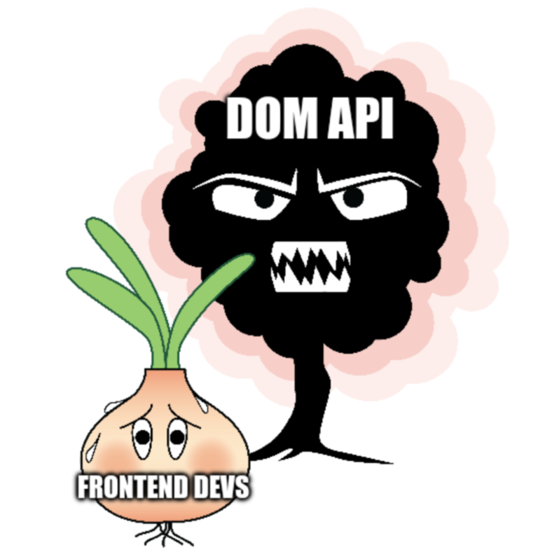

---
# You can also start simply with 'default'
theme: ./theme
# random image from a curated Unsplash collection by Anthony
# like them? see https://unsplash.com/collections/94734566/slidev
# some information about your slides (markdown enabled)
title: ember() adventures with Ember in an imperative world
info: |
  ## ember(): adventures with Ember in an imperative world
# apply unocss classes to the current slide
class: text-center
# https://sli.dev/features/drawing
drawings:
  persist: false
# slide transition: https://sli.dev/guide/animations.html#slide-transitions
transition: slide-left
# enable MDC Syntax: https://sli.dev/features/mdc
mdc: true
# open graph
seoMeta:
  # By default, Slidev will use ./og-image.png if it exists,
  # or generate one from the first slide if not found.
  ogImage: auto
  # ogImage: https://cover.sli.dev
---

# ember[()]{class="text-rpred"}: adventures with Ember in an imperative world

---
layout: center
---
# About me

- <logos-github-icon /> github: [abeforgit](https://github.com/abeforgit)
- <logos-mastodon-icon /> mastodon: [abeforfdv@framapiaf.org](https://framapiaf.org/@abeforfdv)
- <logos-discord-icon /> discord: abefordisc
---

# Redpencil
https://redpencil.io/

- Specialized in interoperability and data modelling
- Committed to open-source
- All ember, all the time


---

# When we talk about ember...

Ember is many things:

<ul>
<li v-mark="{ color: '#dc2626', type: 'box' }"> a DOM rendering framework (glimmer components, template tag syntax) </li>
</ul>

- a reactivity system (`@tracked`)
- a router (router.ts)
- a data-fetching framework (route classes)
- a state management system (services)
- a dependency injection framework (`owner`, `@service`, etc)

---

# The project: say-editor

A specialized wysiwyg rich-text editor, with a heavy focus on creating annotated
text.

building blocks:

- UI: ember
- text editing engine: Prosemirror
- data-parsing: combo of standard parsers and bespoke logic

---

# The project: say-editor

<Transform :scale="0.5">
<Counter />
</Transform>

<div
  v-click
  v-motion
  class="position-absolute top-0 right-0"
  :initial="{ x: 80 }"
  :enter="{ x: 0 }"
  :leave="{ x: -80 }">

</div>

---
layout: center
---


# ember[()]{class="text-rpred"}


<v-click at="1">

# ember[Component()]{class="text-rpred"}
# ember[App()]{class="text-rpred"}

</v-click>

---

# Integrating frameworks in Ember

See Nick's talk - potentially add some things

---

# What I mean with framework

"Things that render to the DOM"

## General-purpose

- react
- vue
- svelte
- ember

## Specialized

- leaflet
- d3
- codemirror
- prosemirror

---

# Frameworks can render your code

d3:

```js
d3.selectAll('div').append(() => document.createElement('p'));
```

---

# Frameworks can render your code

leaflet:

```js
const el = document.createElement('p');
layer.bindPopup(el);
```

---

# Frameworks can render your code

prosemirror nodeviews:

```js
class SectionView {
  constructor(prosemirrorNode, view, getPos, deco) {
    this.dom = document.createElement('section');
    this.header = this.dom.appendChild(document.createElement('header'));
    this.header.contentEditable = 'false';
    this.foldButton = this.header.appendChild(document.createElement('button'));
    this.foldButton.title = 'Toggle section folding';
    this.foldButton.onmousedown = (e) => this.foldClick(view, getPos, e);
    this.contentDOM = this.dom.appendChild(document.createElement('div'));
    this.setFolded(deco.some((d) => d.spec.foldSection));
  }
}
```

---
layout: center
---

# But who wants to write plain html?



---

# Using ember to generate DOM elements

`in-element`

```gjs
destinationElement = document.createElement('div');

<template>
    {{#in-element this.destinationElement}}
      <div>Some content</div>
    {{/in-element}}
</template>

```

---

# Situations where in-element is not enough

<ul>
<v-click>
<li> nesting </li>
</v-click>
<v-click>
<li>other</li> 
</v-click>
</ul>
---

# Before ember 6.8

```ts {1,12-19,21-23,24,26,27}{maxHeight:'400px'}
function emberComponent(
  owner: Owner,
  name: string,
  inline: boolean,
  props: EmberNodeArgs & {
    atom: boolean;
    component: ComponentLike<{ Args: EmberNodeArgs }>;
    contentDOM?: HTMLElement;
  }
): { node: HTMLElement; component: EmberInlineComponent } {
  const componentName = `${name}-${uuidv4()}`;
  owner.register(
    `component:${componentName}`,
    // eslint-disable-next-line ember/no-classic-classes
    Component.extend({
      layout: this.template,
      tagName: '',
      ...props,
    })
  );
  const component = owner.lookup(
    `component:${componentName}`
  ) as EmberInlineComponent;
  const node = document.createElement('div');
  node.classList.add('ember-node');
  component.appendTo(node);
  return { node, component };
}
```

---

# After ember 6.8

```ts {1,11,13-19,21}{maxHeight:'400px'}
function emberComponent(
  owner: Owner,
  inline: boolean,
  comp: ComponentLike<{ Args: EmberNodeArgs }>,
  props: EmberNodeArgs & {
    atom: boolean;
    component: ComponentLike<{ Args: EmberNodeArgs }>;
    contentDOM?: HTMLElement;
  },
): { node: HTMLElement; renderResult: ReturnType<typeof renderComponent> } {
  const node = document.createElement('div');
  node.classList.add('ember-node');
  const renderResult = renderComponent(EmberNodeContainer, {
    into: node,
    args: trackedObject({
      ...props,
      emberNodeComponent: comp,
    }),
  });

  return { node, renderResult };
}
```

---

# renderComponent RFC
https://rfcs.emberjs.com/id/1099-renderComponent


---
layout: quote
---

# Packaging ember as a library

Making ember apps is fun, but....

"Hey that's a cool thing you've build, how can I use it in my angular/react/vue app?"

---

# Pre-vite

Building with broccoli

- `ember build` -> AMD bundle

---

# Pre-vite

Amd bundles are hard to share

```js
import vendor from './ember-build/assets/vendor.js';
import vendorBundle from './ember-build/assets/@lblod/my-app-vendor-bundle.js';
import app from './ember-build/assets/@lblod/my-app-app.js';
import myApp from './ember-build/assets/@lblod/my-app.js';
import editorCss from './ember-build/assets/@lblod/my-app.css';
import vendorCss from './ember-build/assets/vendor.css';
```

Bundlers don't understand these js files

---

# Pre-vite

Ugly solutions for ugly problems

Tell the bundler to treat the built files as plain strings...

```js
// webpack.config.js

  module: {
    rules: [
      {
        test: /ember-build\/assets\/.*\.js$/,
        type: 'asset/source',
        exclude: /node_modules/,
        // use: {
        //   loader: "babel-loader"
        // }
      },
```

---

# Pre-vite

Ugly solutions for ugly problems

...and inject the strings into an iframe

```js {2,15,25-35}{ maxHeight: '400px' }
function renderApp() {
 const editorFrame = document.createElement('iframe');
  editorFrame.setAttribute('srcdoc', srcDoc);
  editorFrame.setAttribute('width', width);
  editorFrame.setAttribute('height', height);
  editorFrame.setAttribute('title', title ?? 'say-editor');
  editorFrame.style.overflow = 'auto';

  element.replaceChildren(editorFrame);

  // wait for the iframe to render
  await new Promise((resolve) =>
    editorFrame.addEventListener('load', resolve, { once: true }),
  );
  const frameDoc = editorFrame.contentDocument!.body;

  // append styles
  const vendorStyle = document.createElement('style');
  vendorStyle.textContent = vendorCss;
  const editorStyle = document.createElement('style');
  editorStyle.textContent = editorCss;
  frameDoc.append(editorStyle, vendorStyle);

  // append scripts
  const vendorScript = document.createElement('script');
  vendorScript.text = vendor;
  frameDoc.appendChild(vendorScript);

  const vendorBundleScript = document.createElement('script');
  vendorBundleScript.text = vendorBundle;
  frameDoc.appendChild(vendorBundleScript);

  const appScript = document.createElement('script');
  appScript.text = app as string;
  frameDoc.appendChild(appScript);

  const embeddableScript = document.createElement('script');
  embeddableScript.text = embeddable as string;
  frameDoc.appendChild(embeddableScript);
}
```

---

# With embroider and vite

Much easier

Thanks to embroider, we can now transform ember-specific JS into standard ES
modules, allowing us to use all the features of the build-system

---

# From app to library: commit-by-commit

https://github.com/abeforgit/portable-ember-demo


---

# Convince ember it doesn't own the whole page

Fixing the environment config

````md magic-move
```ts
import config from 'ember-vite-app/config/environment';

if (macroCondition(isDevelopingApp())) {
  importSync('./deprecation-workflow');
}

export default class App extends Application {
  modulePrefix = config.modulePrefix;
  podModulePrefix = config.podModulePrefix;
  Resolver = Resolver.withModules(compatModules);
}

loadInitializers(App, config.modulePrefix, compatModules);
```

```ts
import config from 'ember-vite-app/config/environment';

if (macroCondition(isDevelopingApp())) {
  importSync('./deprecation-workflow');
}
const modulePrefix = 'my-app-name';
export default class App extends Application {
  modulePrefix = modulePrefix;
  podModulePrefix = modulePrefix;
  Resolver = Resolver.withModules(compatModules);
}

loadInitializers(App, modulePrefix, compatModules);
```
````

---

# Convince ember it doesn't own the whole page

Disconnect the router from the page location

````md magic-move
```ts
export default class App extends Application {
  modulePrefix = modulePrefix;
  podModulePrefix = modulePrefix;
  Resolver = Resolver.withModules(compatModules);
}
```

```ts
export default class App extends Application {
  modulePrefix = modulePrefix;
  podModulePrefix = modulePrefix;
  locationType = 'none';
  Resolver = Resolver.withModules(compatModules);
}
```
````

````md magic-move
```ts
export default class Router extends EmberRouter {
  location = config.locationType;
  rootURL = config.rootURL;
}
```

```ts
export default class Router extends EmberRouter {
  location = 'none';
  rootURL = config.rootURL;
}
```
````

Theoretically this is enough... because the app is already an esmodule!

---

# Manually booting the ember app


````md magic-move
```ts
export default class App extends Application {
  modulePrefix = modulePrefix;
  podModulePrefix = modulePrefix;
  locationType = 'none';
  Resolver = Resolver.withModules(compatModules);
}
```

```ts
export default class App extends Application {
  modulePrefix = modulePrefix;
  podModulePrefix = modulePrefix;
  locationType = 'none';
  autoboot = false;
  Resolver = Resolver.withModules(compatModules);
}
```
````

<v-click>

```ts
import App from './app.ts';
export async function emberApp(element: HTMLElement) {
  const app = App.create({
    autoboot: false,
    name: `ember-vite-app`,
    location: 'none',
  });

  await app.visit('/', {
    rootElement: element,
    location: 'none',
  });
}
```

</v-click>

---

# Vite configuration

vite is just rollup + esbuild, but also a lot more

````md magic-move
```js
import { defineConfig } from 'vite';
import { extensions, classicEmberSupport, ember } from '@embroider/vite';
import { babel } from '@rollup/plugin-babel';

export default defineConfig({
  plugins: [
    classicEmberSupport(),
    ember(),
    // extra plugins here
    babel({
      babelHelpers: 'runtime',
      extensions,
    }),
  ],
});
```

```js
import { defineConfig } from 'vite';
import { extensions, classicEmberSupport, ember } from '@embroider/vite';
import { babel } from '@rollup/plugin-babel';

export default defineConfig({
  build: {
    lib: {
      entry: resolve(__dirname, 'app/app.ts'),
      name: 'ember-vite-app',
      fileName: 'ember-vite-app',
    },
    rollupOptions: {
      input: 'app/main.ts',
    },
  },
  plugins: [
    classicEmberSupport(),
    ember(),
    // extra plugins here
    babel({
      babelHelpers: 'runtime',
      extensions,
    }),
  ],
});
```
````

---

# Vite configuration

build output

````md magic-move
```shellsession
$ tree dist
dist
├── assets
│   ├── main-Br2rsYWF.css
│   └── main-DEN-EFOq.js // minified
├── ember-welcome-page
│   └── images
│       └── construction.png
├── @embroider
│   └── virtual
│       ├── app.css
│       ├── vendor.css
│       └── vendor.js
├── index.html
└── robots.txt

6 directories, 8 files
```

```shellsession
❯ tree dist
dist
├── ember-vite-app.css
├── ember-vite-app.mjs
├── ember-vite-app.umd.js
├── ember-welcome-page
│   └── images
│       └── construction.png
├── @embroider
│   └── virtual
│       ├── app.css
│       ├── vendor.css
│       └── vendor.js
└── robots.txt
```
````

<v-click>
By default, vite outputs both an es module and an umd bundle, which is perfect
for compatibility with just about anything.
</v-click>

---

# Package.json edits

Pointing node to the right files

````md magic-move
```json
  "exports": {
    "./tests/*": "./tests/*",
    "./*": "./app/*",
  },
```

```json
  "exports": {
    "./tests/*": "./tests/*",
    "./*": "./app/*",
    ".": {
      "import": "./dist/ember-vite-app.mjs",
      "require": "./dist/ember-vite-app.umd.js"
    }
  },
  "main": "./dist/assets/ember-vite-app.umd.js",
  "module": "./dist/assets/ember-vite-app.mjs",
  "files": [
    "dist"
  ],
```
````


---

# Things to look out for

- global style rules (e.g. media-queries, use container queries instead!)
- shadow-dom or not?
- addon assumptions

---

# Combining with renderComponent
https://github.com/NullVoxPopuli/smol-est-ember-app/tree/main


---

# Special thanks


---
